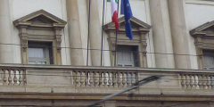

Example Laplacian filter implementation with Vivado HLS and AXI4-Stream.

You can view the result using GIMP2 with RAW format.

Original image size is 240x120 pixels (which is output as solution1/csim/build/image.data).
Result image size is 238x118 pixels (which is output as solution1/csim/build/result.data).

This branch implements parallel filter. Generates 2 pixels of output per each clock.
AXI-Stream interface is 64 bits, which utilizes maximum bitwidth of the Zynq's HP port.

Original: 

Output: 
