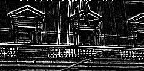

Example Laplacian filter implementation with Vivado HLS and AXI4-Stream.

You can view the result using GIMP2 with RAW format.
Result image size is 238x118 pixels (which is output as solution1/csim/build/result.data)

